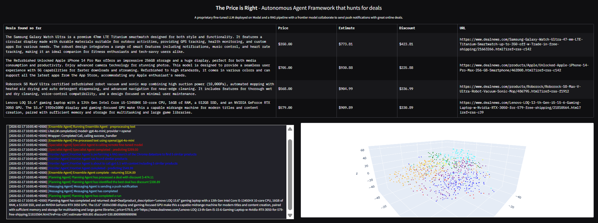

# Deal Scanner: Agentic Bargain Discovery

An end-to-end, production-style **agentic AI system** that autonomously discovers online product deals, estimates fair value with an ensemble of AI estimators, and notifies users when opportunities cross a discount threshold.

This repository is structured to showcase practical AI engineering quality:
- multi-agent orchestration
- RAG + frontier model inference
- fine-tuned model serving on Modal
- observability-first UI
- reproducible setup and quality checks

## UI Preview



### UI components

- **Top table: `Deals found so far`**
  - In-memory + persisted surfaced opportunities.
  - `Price`: scraped deal price.
  - `Estimate`: ensemble-estimated true value.
  - `Discount`: `Estimate - Price`.
  - `URL`: source page.

- **Bottom-left: live logs panel**
  - Real-time logs from Scanner, Ensemble, Specialist, Frontier, Planner, and Messaging agents.
  - Useful for tracing latency, provider calls, and failures.

- **Bottom-right: 3D vector plot**
  - t-SNE projection of Chroma embedding vectors.
  - Point colors map to categories.
  - Useful for sanity-checking semantic clustering and retrieval behavior.

---

## 1) Project Purpose

### Problem
Deal feeds are noisy and inconsistent. A robust system must:
- ingest from multiple sources
- normalize unstructured product text
- extract reliable deal pricing
- estimate likely true value
- alert only when discount confidence is meaningful

### Solution
This project implements an autonomous pipeline where each agent has a narrow, auditable role:
- `ScannerAgent`: finds and structures deals
- `EnsembleAgent`: estimates value with two estimators
- `PlanningAgent`: selects best opportunities and applies threshold policy
- `MessagingAgent`: sends notifications
- `DealAgentFramework`: orchestrates runtime + memory persistence
- `price_is_right.py`: provides a live monitoring and interaction UI

---

## 2) Technical Highlights

- **Agentic architecture** with explicit role boundaries and orchestrated workflow
- **RAG estimator** (`FrontierAgent`) using Chroma retrieval + OpenAI frontier model
- **Specialist estimator** (`SpecialistAgent`) backed by a fine-tuned Hugging Face model deployed on Modal
- **Ensemble strategy** (Frontier + Specialist weighted blend)
- **Structured outputs** with Pydantic schemas for deterministic parsing
- **Production UI observability** (memory table, live logs, vector-space plot)
- **Operational hardening** (empty vector DB handling, logging lifecycle cleanup, safer callbacks)

---

## 3) End-to-End Runtime Flow

1. `ScannerAgent` scrapes RSS feeds and source pages (`agents/deals.py`).
2. It calls OpenAI with structured schema (`DealSelection`) to produce high-quality, priced candidates.
3. `PlanningAgent` runs candidates through `EnsembleAgent`.
4. `EnsembleAgent`:
   - preprocesses product description (`Preprocessor` via LiteLLM)
   - gets RAG estimate from `FrontierAgent`
   - gets specialist estimate from Modal-hosted model (`SpecialistAgent`)
   - computes weighted blend
5. `PlanningAgent` calculates discount (`estimate - price`) and picks best deal.
6. If discount passes threshold (`DEAL_THRESHOLD`), `MessagingAgent` sends push notification.
7. Returned opportunity is persisted to `memory.json` and rendered in the UI.

---

## 4) Agent-by-Agent Breakdown

### `ScannerAgent` (`agents/scanner_agent.py`)
- Scrapes deal candidates from RSS + linked pages
- Removes already-seen URLs using memory state
- Uses OpenAI structured outputs into `DealSelection`
- Optimized to avoid common pricing extraction mistakes (e.g., "$X off" confusion)

### `FrontierAgent` (`agents/frontier_agent.py`)
- Encodes query text with `sentence-transformers/all-MiniLM-L6-v2`
- Retrieves semantically similar products from Chroma
- Injects retrieval context into prompt
- Calls OpenAI frontier model for price estimate
- Parses numeric output robustly

### `SpecialistAgent` (`agents/specialist_agent.py`)
- Calls a Modal-deployed class service (`pricer-service.Pricer`)
- Uses fine-tuned Hugging Face model inference remotely
- Includes runtime guard/error guidance when Modal SDK is missing

### `Preprocessor` (`agents/preprocessor.py`)
- Rewrites noisy raw descriptions into concise normalized format
- Uses LiteLLM `completion()` with OpenAI defaults
- Tracks token/cost counters for analysis

### `EnsembleAgent` (`agents/ensemble_agent.py`)
- Current blend:
  - `FrontierAgent` weight: `0.9`
  - `SpecialistAgent` weight: `0.1`
- Legacy neural-network path removed from active runtime

### `PlanningAgent` (`agents/planning_agent.py`)
- Coordinates scan -> estimate -> rank -> notify
- Applies threshold policy (`DEAL_THRESHOLD = 50`)
- Returns only high-confidence opportunities

### `MessagingAgent` (`agents/messaging_agent.py`)
- Sends push notifications via Pushover API
- Supports optional LLM-crafted message body through LiteLLM

---

## 5) Repository Structure

```text
agents/
  agent.py
  deals.py
  scanner_agent.py
  frontier_agent.py
  specialist_agent.py
  preprocessor.py
  ensemble_agent.py
  planning_agent.py
  messaging_agent.py
  autonomous_planning_agent.py
  evaluator.py
  items.py

deal_agent_framework.py
price_is_right.py
main.py
pricer_service2.py
pyproject.toml
.env.example
tests/test_ensemble_agent.py
docs/ARCHITECTURE.md
docs/DEVELOPMENT_JOURNEY.md
```

---

## 6) Prerequisites

- Python 3.11+
- [`uv`](https://docs.astral.sh/uv/)
- OpenAI API key
- Modal account + deployed specialist service
- Optional: Pushover account

---

## 7) Setup and Run

### Step A: Install dependencies
```bash
uv sync --extra modal
```

### Step B: Configure environment
```bash
cp .env.example .env
```

PowerShell:
```powershell
Copy-Item .env.example .env
```

Minimum:
```env
OPENAI_API_KEY=...
```

Common optional configuration:
```env
PRICER_PREPROCESSOR_MODEL=openai/gpt-4o-mini
PRICER_MESSAGING_MODEL=openai/gpt-4o-mini
PLANNER_INTERVAL_SECONDS=120
PUSHOVER_USER=...
PUSHOVER_TOKEN=...
```

### Step C: Deploy specialist service (Modal)
```bash
uv run modal deploy -m pricer_service2
```

### Step D: Launch app
```bash
uv run price_is_right.py
```

Alternative console script:
```bash
uv run deal-scanner
```

---

### Runtime behavior

- One planning run on initial page load.
- Repeated runs on timer (`PLANNER_INTERVAL_SECONDS`, default `120`).
- New row appears only when a new qualifying opportunity is returned by planner.
- Clicking a table row sends a manual push alert for that selected opportunity.

---

## 8) Sample Results and Performance Snapshot

Example outcomes from a successful run:

| Metric | Sample Observation |
|---|---|
| Candidate deals fetched | 30 |
| Deals selected by scanner | 5 |
| Best surfaced discount | `$336.99` |
| Example surfaced product | `Roborock S8 MaxV Ultra` |
| Example deal price | `$568.00` |
| Example estimated value | `$904.99` |
| Planning interval | `120s` |

Observed per-item pipeline timing (approx):
- Preprocessor (LiteLLM + OpenAI): ~2-3s
- Specialist (Modal fine-tuned model): ~1-40s (cold/warm variance)
- Frontier (RAG retrieval + OpenAI call): ~1-3s

Notes:
- Modal cold starts can increase first specialist call latency.
- New table rows appear only for opportunities that pass threshold policy.
- These values are run-dependent and vary by source quality and provider latency.

---

## 9) Design Tradeoffs and Engineering Decisions

### Why a two-estimator ensemble?
- Frontier model + RAG contributes strong contextual reasoning from similar products.
- Specialist model contributes domain-specific signal from fine-tuned behavior.
- Weighted blend reduces single-model bias and stabilizes estimates.

### Why `0.9 / 0.1` weights?
- Frontier estimator showed stronger consistency across mixed categories.
- Specialist estimator still adds value, but with higher variance across some items.
- Current weighting favors robustness while preserving specialist signal.

### Why threshold-based alerting (`DEAL_THRESHOLD=50`)?
- Reduces noisy notifications from marginal/uncertain price gaps.
- Keeps alerts actionable and minimizes user fatigue.

### Why structured outputs for scanner?
- Enforces schema reliability (`DealSelection`) and reduces downstream parsing failures.
- Makes planner logic deterministic and easier to test.

### Why keep both event logs and UI memory table?
- Logs provide observability/debuggability.
- Memory table provides operator-facing state and user-visible outcomes.

---

## 10) Development and Quality Checks

Lint:
```bash
uv run --extra dev ruff check .
```

Tests:
```bash
uv run --extra dev pytest -q
```

Compile sanity:
```bash
uv run python -m compileall -q main.py price_is_right.py deal_agent_framework.py agents
```

---

## 11) Reliability and Engineering Decisions

- Prevent duplicate root logger stream handlers between runs.
- Attach/detach UI queue handlers cleanly to avoid handler accumulation.
- Gracefully handle empty/small vector stores for plotting.
- Guard selection callback paths to avoid `None` planner crashes.
- Keep model/provider selection configurable via environment variables.

---

## 12) Security and Secrets

- Do not commit `.env`, tokens, or private credentials.
- Use secret managers/Modal secrets in deployment environments.
- `.gitignore` excludes runtime artifacts (`memory.json`, vector DB, local logs, etc.).

---

## 13) Known Limitations

- Deal quality depends on source feed quality and page structure stability.
- Price extraction still depends on model interpretation of noisy descriptions.
- Specialist path requires Modal service availability.
- Notification delivery depends on valid Pushover credentials.

---

## 14) Future Enhancements

- Add confidence scoring and richer explanation metadata.
- Add retry/backoff/circuit-breaker around provider calls.
- Add integration tests with mocked external APIs.
- Add latency/cost telemetry dashboards.
- Expand feed sources and category-specific ranking policies.

---

## 15) Portfolio / Resume Relevance

This project demonstrates practical expertise in:
- agentic AI system design
- OpenAI + LiteLLM integration
- RAG pipelines (embeddings + Chroma retrieval)
- production model serving with Modal + Hugging Face
- Python backend architecture and runtime reliability
- product UI delivery with Gradio and Plotly
- testing, linting, packaging, and operational documentation

---

## 16) License

MIT License. See `LICENSE`.
